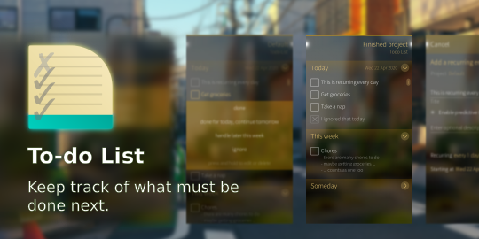

<!--
SPDX-FileCopyrightText: 2018-2024 Mirian Margiani
SPDX-License-Identifier: GFDL-1.3-or-later
-->

# To-do List for Sailfish OS

To-do List is a simple to-do list manager with support for multiple projects

**Features:**

- multiple projects
- recurring entries
- today's unfinished entries will be carried over for tomorrow
- four categories: today, tomorrow, this week, someday
- archive of all past entries

**Planned features:**

- auto-completion and suggestions when adding new entries
- import and export
- support for Markdown formatting
- notifications for recurring tasks
- searching past and present tasks
- meta-projects
- finer control over recurring entries (e.g. repeat at the n-th of every month)
- option to sort entries manually

## Help and support

You are welcome to [leave a comment in the forum](https://forum.sailfishos.org/t/apps-by-ichthyosaurus/15753)
if you have any questions or ideas.

## Translations

It would be wonderful if the app could be translated in as many languages as possible!

Translations are managed using
[Weblate](https://hosted.weblate.org/projects/harbour-todolist/translations).
Please prefer this over pull request (which are still welcome, of course).
If you just found a minor problem, you can also
[leave a comment in the forum](https://forum.sailfishos.org/t/apps-by-ichthyosaurus/15753)
or [open an issue](https://github.com/ichthyosaurus/harbour-todolist/issues/new).

Please include the following details:

1. the language you were using
2. where you found the error
3. the incorrect text
4. the correct translation

### Manually updating translations

Please prefer using
[Weblate](https://hosted.weblate.org/projects/harbour-todolist) over this.
You can follow these steps to manually add or update a translation:

1. *If it did not exist before*, create a new catalog for your language by copying the
   base file [translations/harbour-todolist.ts](translations/harbour-todolist.ts).
   Then add the new translation to [harbour-todolist.pro](harbour-todolist.pro).
2. Add yourself to the list of contributors in [qml/pages/AboutPage.qml](qml/pages/AboutPage.qml).
3. (optional) Translate the app's name in [harbour-todolist.desktop](harbour-todolist.desktop)
   if there is a (short) native term for it in your language.

See [the Qt documentation](https://doc.qt.io/qt-5/qml-qtqml-date.html#details) for
details on how to translate date formats to your *local* format.

## Building and contributing

*Bug reports, and contributions for translations, bug fixes, or new features are always welcome!*

1. Clone the repository by running `git clone --recurse-submodules https://github.com/ichthyosaurus/harbour-todolist.git`
2. Apply necessary patches: `git apply libs/*.patch`
2. Open `harbour-todolist.pro` in Sailfish OS IDE (Qt Creator for Sailfish)
3. To run on emulator, select the `i486` target and press the run button
4. To build for the device, select the `armv7hl` target and click “deploy all”;
   the RPM packages will be in the `RPMS` folder

If you contribute, please do not forget to add yourself to the list of
contributors in [qml/pages/AboutPage.qml](qml/pages/AboutPage.qml)!

## Donations

If you want to support my work, I am always happy if you buy me a cup of coffee
through [Liberapay](https://liberapay.com/ichthyosaurus).

Of course it would be much appreciated as well if you support this project by
contributing to translations or code! See above how you can contribute 🎕.

## License

> Copyright (C) 2020-2024  Mirian Margiani

To-do List is Free Software released under the terms of the
[GNU General Public License v3 (or later)](https://spdx.org/licenses/GPL-3.0-or-later.html).
The source code is available [on Github](https://github.com/ichthyosaurus/harbour-todolist).
All documentation is released under the terms of the
[GNU Free Documentation License v1.3 (or later)](https://spdx.org/licenses/GFDL-1.3-or-later.html).

This project follows the [REUSE specification](https://api.reuse.software/info/github.com/ichthyosaurus/harbour-todolist).
