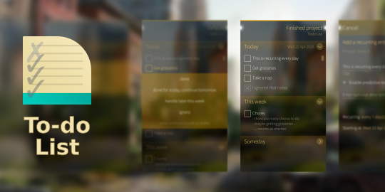

<!--
SPDX-FileCopyrightText: 2020-2021 Mirian Margiani
SPDX-License-Identifier: GFDL-1.3-or-later
-->

# To-do List for Sailfish OS

<!--  -->

<!--  -->

A simple to-do list manager for keeping track of what has to be done next.

### Features

- multiple projects
- recurring entries
- today's unfinished entries will be carried over for tomorrow
- four categories: today, tomorrow, this week, someday
- archive of all past entries

#### Planned features

- auto-completion and suggestions when adding new entries
- import and export
- support for Markdown formatting
- notifications for recurring tasks
- searching past and present tasks
- meta-projects
- finer control over recurring entries (e.g. repeat at the n-th of every month)
- option to sort entries manually

## Help and support

You are welcome to leave a comment on
[OpenRepos](https://openrepos.net/content/ichthyosaurus/todolist) or
in the Jolla store.

## Contributing

*Bug reports, and pull requests for translations, bug fixes, or new features are always welcome!*

### Translations

It would be wonderful if the app could be translated in as many languages as possible!

If you just found a typo, you can [open an issue](https://github.com/ichthyosaurus/harbour-todolist/issues/new).
Include the following details:

1. the language you were using
2. where you found the error
3. the wrong text
4. the correct translation

To add or update a translation, please follow these steps:

1. *If it did not exists before*, create a new catalog for your language by copying the
   base file [translations/harbour-todolist.ts](translations/harbour-todolist.ts).
   Then add the new translation to [harbour-todolist.pro](harbour-todolist.pro). You will
   find instructions at the top of the file.
2. Add yourself to the list of contributors in [qml/pages/AboutPage.qml](qml/pages/AboutPage.qml).
   You will find instructions in the file.
3. Translate the app's name in [harbour-todolist.desktop](harbour-todolist.desktop).
   You will find instructions in the file.
4. Translate everything else...

Please do not forget to translate the date formats to your local format. You can
find details on the available fields [in the Qt documentation](https://doc.qt.io/qt-5/qml-qtqml-date.html#details).
Also, if there is a (short) native term for "to-do list" in your language, please
translate the app's name.

### Other contributions

Please do not forget to add yourself to the list of contributors in
[qml/pages/AboutPage.qml](qml/pages/AboutPage.qml)!

## Development

1. Check-out this repository and update submodules:

        git clone https://github.com/ichthyosaurus/harbour-todolist.git todolist
        cd todolist
        git submodule update --init --recursive

2. Add the line `#include <QtQml>` at the top of the following files:

        libs/SortFilterProxyModel/filters/filtersqmltypes.cpp
        libs/SortFilterProxyModel/sorters/sortersqmltypes.cpp

3. Open `harbour-todolist.pro` in Sailfish OS IDE (Qt Creator for Sailfish)
4. To run on emulator, select the `i486` target and press the run button
5. To build for the device, select the `armv7hl` target and deploy all,
   the RPM packages will be in the RPMS folder

## License

> Copyright (C) 2020-2021  Mirian Margiani

`harbour-todolist` is Free Software released under the terms of the
[GNU General Public License v3 (or later)](https://spdx.org/licenses/GPL-3.0-or-later.html).
The source code is available [on Github](https://github.com/ichthyosaurus/harbour-todolist).
All documentation is released under the terms of the
[GNU Free Documentation License v1.3 (or later)](https://spdx.org/licenses/GFDL-1.3-or-later.html).

This project follows the [REUSE specification](https://api.reuse.software/info/github.com/ichthyosaurus/harbour-todolist).

### Acknowledgements

`harbour-todolist` uses [SortFilterProxyModel](https://github.com/oKcerG/SortFilterProxyModel)
by Pierre-Yves Siret, released under the MIT License.
